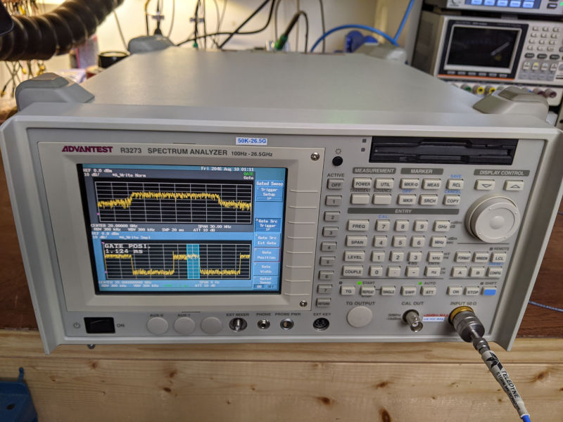
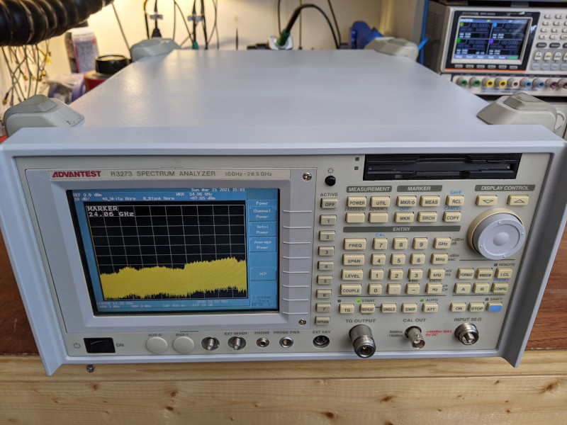
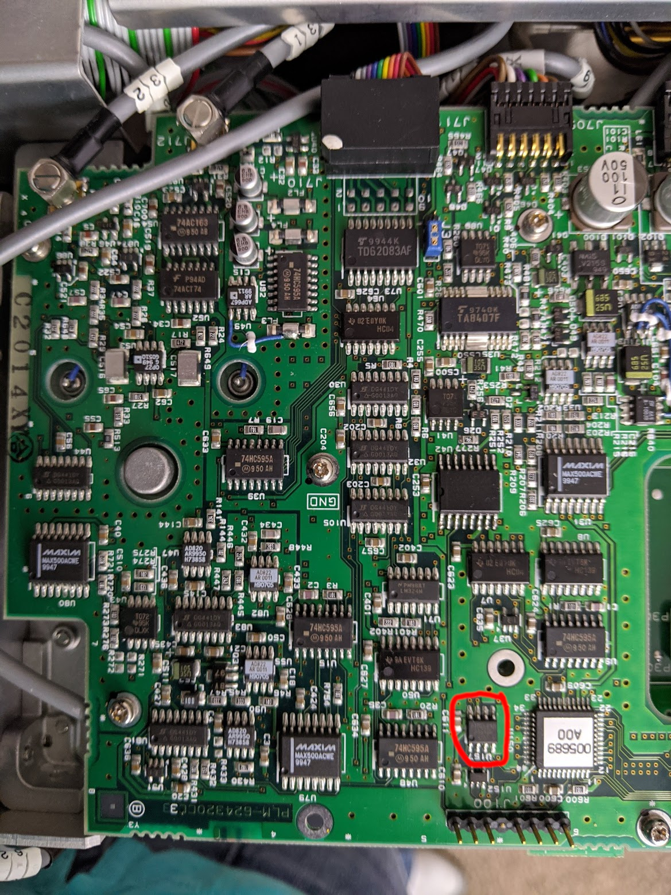
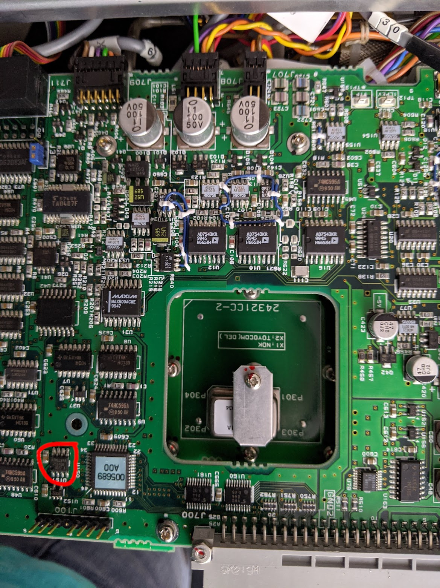
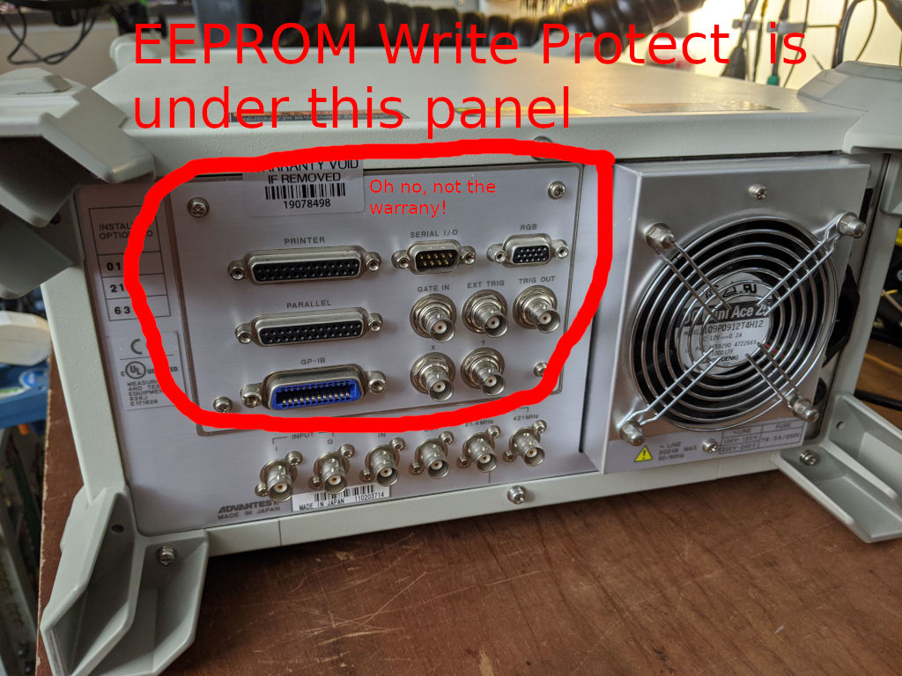

# Advantest R3273 Calibration

This is some code I wrote to calibrate my pair of Advantest R3273 spectrum analyzers. Hopefully other R3273 owners find it helpful as well!

# EEPROM Notes

The first step is to obtain read/write capability in the metrology EEPROM. This is stored on a small chip on the interior-facing side of the microwave deck. I updated it the hard way: by taking measurements, removing the deck, programming the chip, replacing it, and verifying that (thankfully) the act of replacing the deck did not meaningfully degrade the calibration. When connectors with metal mating surfaces are used with proper torque wrenches, it appears that they are repeatable after all.

That said, if I were doing this again I would pay attention to the recent discoveries of GPIB $R/$W commands on the Advantest mailing list (https://groups.io/g/advantestinstrument). If the addresses are unknown/ambiguous, look at the EEPROM images in the `fc` folder of this repository and pattern match until they line up. This approach is likely to be easier and to produce fewer sources of assembly/disassembly variation, small as they may be, compared to the approach I used.

The EEPROM write protect switch is under this panel:

# Calibraiton Notes

This calibration only does a level calibration. I believe (it has been a few years) coarse YIG tuning can be performed in the system calibration menu opened with Shift+Format/Window+882323+Hz. Fine tuning might happen using "field5" in r3273.py, but I don't really know. If you figure it out, you may also be interested in the "YTF Optimization" section of [my 8560E calibration](https://github.com/jjoonathan/8560E-Calibration/blob/main/HP8560SweepResults.py), which computes a smooth YIG trajectory from raw 2D measurements of the form yig_attenuation_dB(coarse_freq,dac_setting). Good luck, have fun, and let me know how it goes!

# Files

**r3273.py:** Interprets and modifies binary EEPROM blobs

**r3273_freqcorr.ipynb:** Sweeps SG, PM to gather cal info for SA.

**step_atten_measurements:** S parameters of working step attenuator

**fc:** EEPROM images
